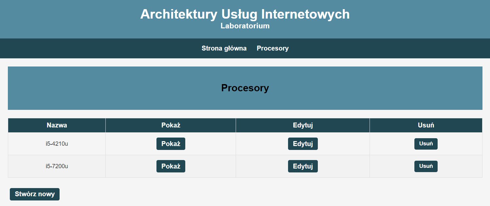
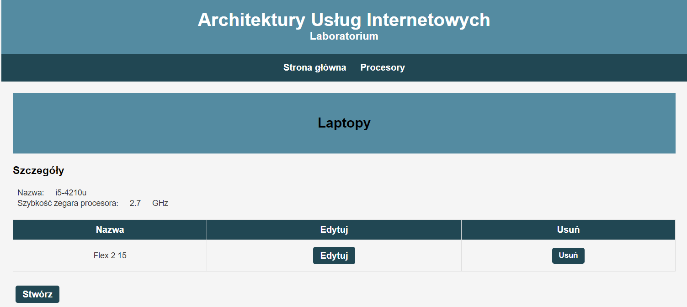

# Java Microservices Architecture using Spring Boot

This project implements a microservices-based architecture using Java and the Spring Boot framework. It includes three services: a gateway service, a processors service, and a laptops service. The gateway service acts as a single entry point for incoming requests and routes them to the appropriate microservice based on the request's URI path.

## Architecture

The architecture of this project is as follows:

```
                      +--------------+
  +---------------+   |  Processors  |
  |               |   |   Service    |
  |   Gateway     |   |   (8081)     |
  |   Service     +-->+--------------+
  |   (8080)      |
  |               +-->+--------------+
  |               |   |   Laptops    |
  +-----------+---+   |   Service    |
              |       |   (8082)     |
              |       +--------------+
              |
              v
        +----------+
        | Frontend |
        | (8083)   |
        +----------+  
    
```

## Technologies Used

- Java 11
- Spring Boot
- Spring Cloud Gateway
- Maven
- H2 Database
- Lombok
- JavaScript
- CSS
- HTML5
- Node.js
- http-client library

## Running the Application

To run this application, you will need to have Java 11 and Maven installed on your machine. You can then follow these steps:

1. Clone this repository to your local machine.
2. Navigate to the root directory of the project.
3. Build the project by running the following command:

```
mvn clean install
```
4. Run the laptops service by running the following command:

```
mvn spring-boot:run -pl laptops
```
5. Run the processors service by running the following command:

```
mvn spring-boot:run -pl processors
```
6. Run the gateway service by running the following command:

```
mvn spring-boot:run -pl gateway
```

7. Install the http-client library by running the following command:

```
npm install http-client
```

8. Navigate to the "client" directory and run the following command to install the frontend dependencies:

```
npm install
```

9. Run the frontend client by running the following command:

```
npm run dev
```

The gateway service will be running on http://localhost:8080, the processors and laptops services will be running on http://localhost:8081 and http://localhost:8082 respectively, and the frontend client will be running on http://localhost:8083.

## API Endpoints

The following API endpoints are available in this application:

### Processors Service

- `GET /api/processors`: Get a list of all processors.
- `GET /api/processors/{id}`: Get the processor with the specified ID.
- `POST /api/processors`: Create a new processor.
    - Request body:
    ```json
        {
          "brand": "brand name",
          "name": "model name",
          "cpuClockSpeed": 1.0
        }
    ```
- `PUT /api/processors/{id}`: Update the processor with the specified ID.
- `DELETE /api/processors/{id}`: Delete the processor with the specified ID.
- `GET /api/processors/{id}/laptops`: Get a list of laptops with the specified processor ID.
- `POST /api/processors/{id}/laptops`: Create a new laptop
    - Request body:
    ```json
        {
          "brand": "brand name",
          "model": "model name",
          "screenSize": 15.6,
          "ram": 16,
          "processorId": 1
        }
    ```
- `DELETE /api/processors/{id}/laptops/{id}`: Delete the laptop with the specified ID that is associated with the processor with the specified ID.

### Laptops Service

- `GET /api/laptops`: Get a list of all laptops.
- `GET /api/laptops/{id}`: Get the laptop with the specified ID.
- `POST /api/laptops`: Create a new laptop.
- `PUT /api/laptops/{id}`: Update the laptop with the specified ID.
- `DELETE /api/laptops/{id}`: Delete the laptop with the specified ID.

### Frontend Client
The frontend client is a web application that displays information about processors and laptops. It sends HTTP requests to the backend Gateway service's API endpoints, which in turn routes the requests to the appropriate microservice based on the request's URI path.

To connect to the backend Gateway service, the frontend client uses JavaScript code to send HTTP requests using the http-client library. For example, the following code sends a GET request to retrieve information about a processor:

```javascript
const xhttp = new XMLHttpRequest();
xhttp.onreadystatechange = function () {
    if (this.readyState === 4 && this.status === 200) {
        displayProcessor(JSON.parse(this.responseText));
    }
};
xhttp.open("GET", getBackendUrl() + '/api/processors/' + getParameterByName('processor'), true);
xhttp.send();
```
In this code, **getParameterByName('processor')** is a function that retrieves the value of the processor query parameter from the current URL. The value is used to construct the URL for the **/api/processors/{id}** endpoint.

When the request is complete, the onreadystatechange function checks that the request is in the DONE state and has a status of 200 (indicating success). If the request is successful, the response data is parsed as JSON using **JSON.parse()** and passed to the **displayProcessor()** function, which renders the processor information on the page.
## Screenshots

Here are some screenshots of the application:





